<p align="center">
  <picture>
    <source media="(prefers-color-scheme: dark)" srcset="docs/readme/banner-dark.svg">
    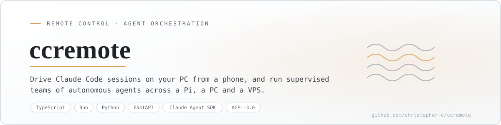
  </picture>
</p>

<p align="center"><sub>English · <a href="#version-française">Version française</a></sub></p>

# ccremote

I talk to an orchestrator from my phone, and it runs teams of Claude Code agents on my machines while I am somewhere else.

Concretely, two systems share one web page served from a Raspberry Pi. A **harness** where an orchestrator drafts mandates, spawns supervised teams on a PC (or a VPS when the PC is off), keeps every thread in a registry, and works on its own inside the autonomy you grant it. And a **control panel** for the machine itself: tmux sessions, metrics, Wake-on-LAN, Claude accounts and their quotas.

> Status: in production for my own use since 22 July 2026, on three machines. This is infrastructure I run every day, not a packaged product. Last active August 2026.

<p align="center">
  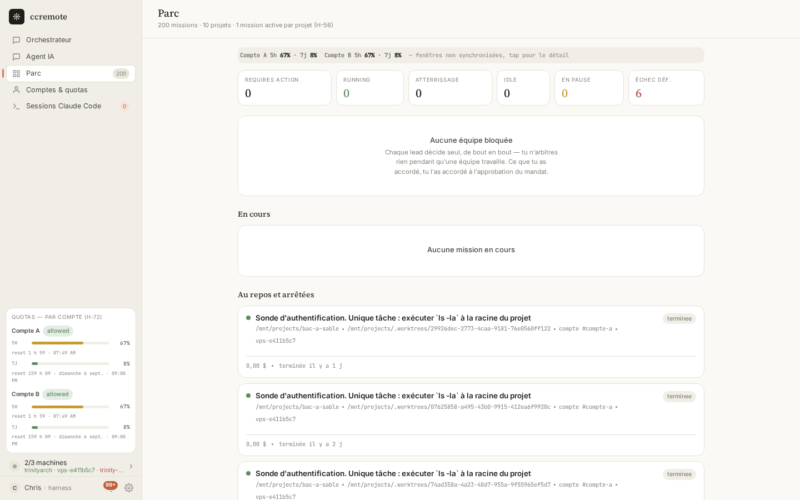
</p>
<p align="center"><sub>The fleet view: usage windows per Claude account, team states at a glance, and the missions that just finished, with their cost.</sub></p>

## What it does

- Runs one orchestrator session on the Pi that serves all your threads, drafts mandates, dispatches teams and reports back.
- Starts a team as a real worker on the PC: one process, one Claude Code session, one git worktree of its own.
- Asks for your approval the first time in a thread, then works inside the autonomy window you opened, up to a ceiling you set.
- Holds the fleet with guardrails: forbidden Bash patterns, a judge that catches agents going in circles, budgets per team, a ceiling per account.
- Learns between missions: lessons are extracted from the transcripts, consolidated, and pushed into the next mandate.
- Keeps a registry of workers with fencing and an emergency stop, one SQLite file per machine.
- Drives the PC itself: list, start and kill tmux sessions, capture a pane, send keys, read metrics, wake it or shut it down.
- Shows Claude accounts with their five-hour and seven-day windows, and switches between them.
- Comes with [Vigie](https://github.com/Chrlstopher-c/vigie), a native iOS client for the same control plane.

## How it works

<p align="center">
  <picture>
    <source media="(prefers-color-scheme: dark)" srcset="docs/readme/how-it-works-dark.svg">
    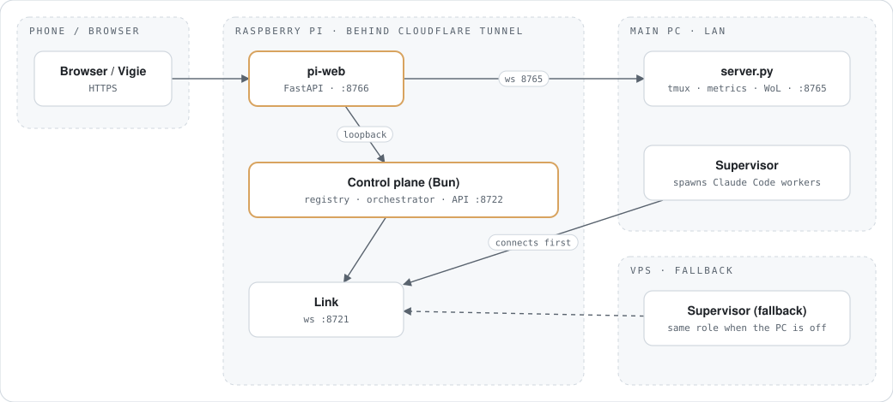
  </picture>
</p>

The Pi is the only machine reachable from outside, through a Cloudflare Tunnel. `pi-web` holds the session and proxies to the harness API, which refuses to start on anything but loopback. Supervisors on the PC and the VPS connect *to* the Pi's link, so no other machine needs an inbound port. Start the PC side first: the Pi reconciles against it at boot.

## The orchestration system

<p align="center">
  <picture>
    <source media="(prefers-color-scheme: dark)" srcset="docs/readme/roles-dark.svg">
    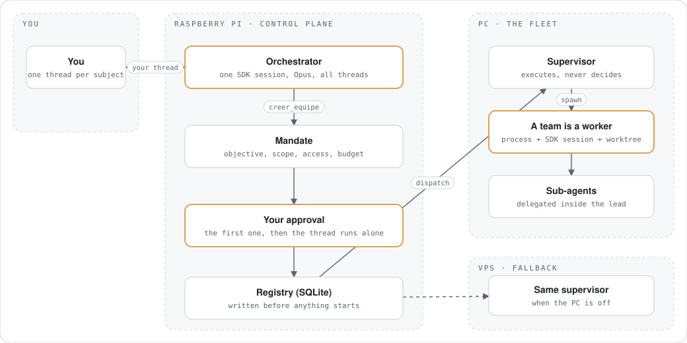
  </picture>
</p>

Four words, and they are not interchangeable. A **mandate** is a text: objective, scope, access, budget, stop rule. A **team** is that mandate once it is running. A **worker** is what the team physically is on the PC: a process, an SDK session and a git worktree. A **thread** is your conversation with the orchestrator, and there is one orchestrator for all of them.

<p align="center">
  <picture>
    <source media="(prefers-color-scheme: dark)" srcset="docs/readme/lifecycle-dark.svg">
    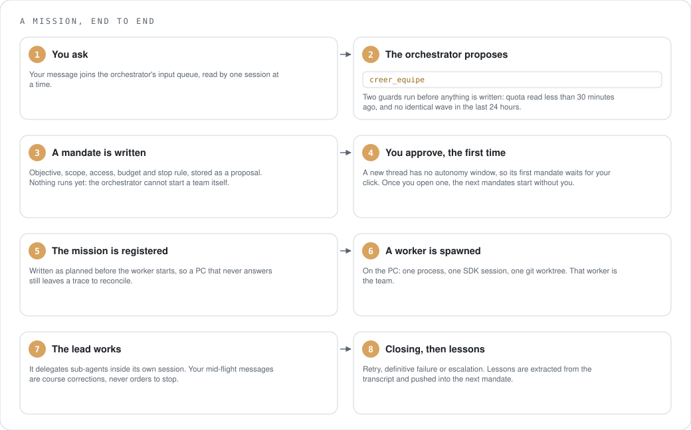
  </picture>
</p>

The orchestrator cannot start a team by itself, by construction: `creer_equipe` writes a proposal and stops there. Dispatching happens on a write route that no agent session can reach.

### How much you are asked

<p align="center">
  <picture>
    <source media="(prefers-color-scheme: dark)" srcset="docs/readme/autonomy-dark.svg">
    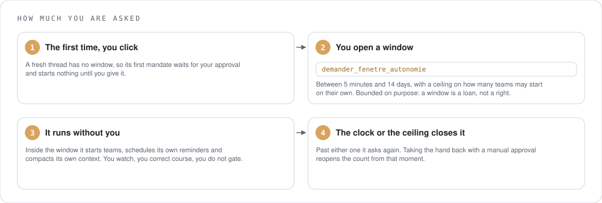
  </picture>
</p>

This is the part I care most about. Gating every mandate would defeat the point: I am not there. So a thread earns a window, and inside it the orchestrator starts teams, sets its own reminders and compacts its own context without asking. The window is bounded on purpose, because an unbounded one is not a window.

### The guardrails

<p align="center">
  <picture>
    <source media="(prefers-color-scheme: dark)" srcset="docs/readme/guardrails-dark.svg">
    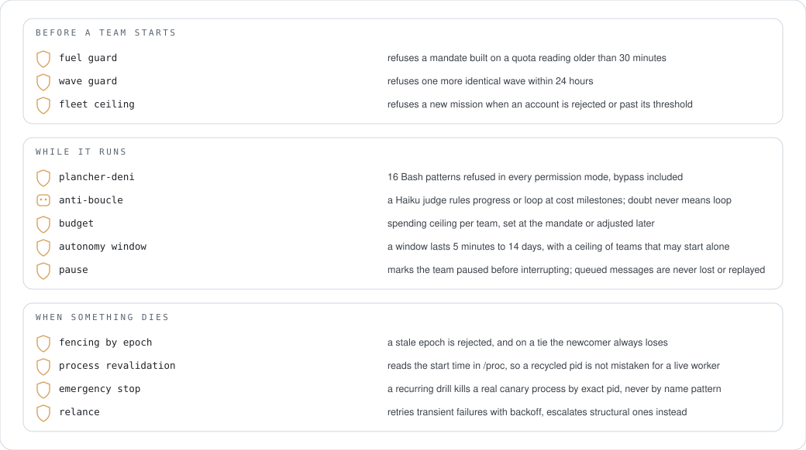
  </picture>
</p>

Two of them are worth the detail. The Bash floor holds in *every* permission mode, including the one that bypasses permission prompts, because a team running unattended at 3 a.m. is exactly when it matters. And the loop judge is biased: on doubt, or when it cannot answer at all, the verdict is "unclear", never "loop". Killing a working team costs more than letting a stuck one burn one more milestone.

### Which model does what

<p align="center">
  <picture>
    <source media="(prefers-color-scheme: dark)" srcset="docs/readme/models-dark.svg">
    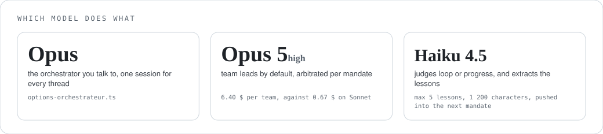
  </picture>
</p>

The orchestrator picks per mandate: Opus when the team has to design something, Sonnet when it has to execute a known plan. The gap between the two is roughly tenfold on the bill, which is why the choice is explicit rather than a default.

## Install

<p align="center">
  <picture>
    <source media="(prefers-color-scheme: dark)" srcset="docs/readme/install-dark.svg">
    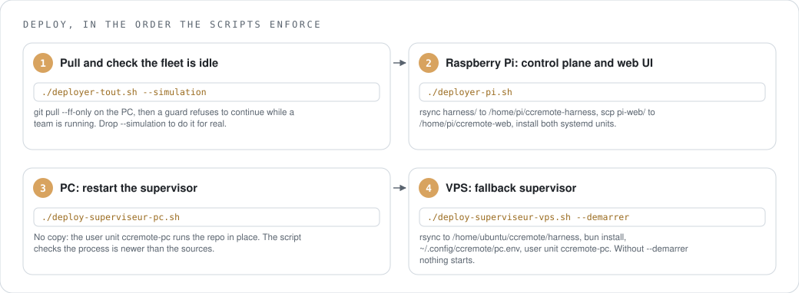
  </picture>
</p>

```sh
./deployer-tout.sh --simulation     # dry run of the whole sequence
./deployer-tout.sh                  # Pi, then PC, then VPS, in that order
```

Everything on one machine, for development:

```sh
cd server && python3 -m venv venv && venv/bin/pip install -r requirements.txt && venv/bin/python server.py
./start.sh                          # pi-web on :8766, needs pi-web/.env
cd harness && bun install && cp .env.example .env && bun run typecheck && bun test
bun run start:pc                    # then, in another shell:
bun run start:pi
```

The three `.env.example` files list every variable. None of them ships with a real value.

## Use

<p align="center">
  <picture>
    <source media="(prefers-color-scheme: dark)" srcset="docs/readme/usage-dark.svg">
    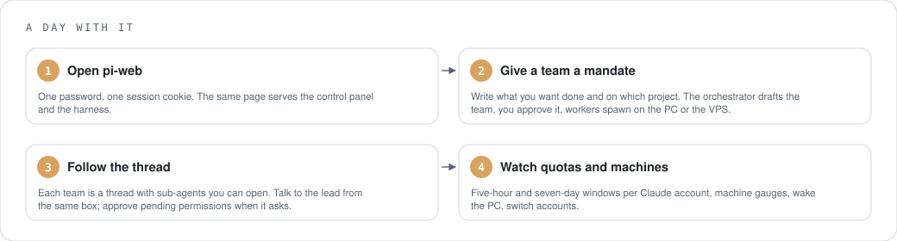
  </picture>
</p>

A team you have approved runs to the end without you; what you granted at the mandate is what it has. Your mid-flight messages are course corrections, not orders to stop.

## On your phone

<p align="center">
  <a href="https://github.com/Chrlstopher-c/vigie">
    <picture>
      <source media="(prefers-color-scheme: dark)" srcset="docs/readme/vigie-dark.svg">
      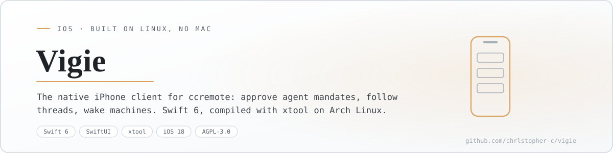
    </picture>
  </a>
</p>

[**Vigie**](https://github.com/Chrlstopher-c/vigie) is the native iOS client for this control plane: settle a decision with Face ID, follow a thread, talk to a lead, wake a machine, dictate a message. Swift 6 and SwiftUI, compiled on Arch Linux with xtool, without a Mac. The web page works fine on a phone; Vigie is what I actually keep in my pocket.

## Where things live

<p align="center">
  <picture>
    <source media="(prefers-color-scheme: dark)" srcset="docs/readme/files-dark.svg">
    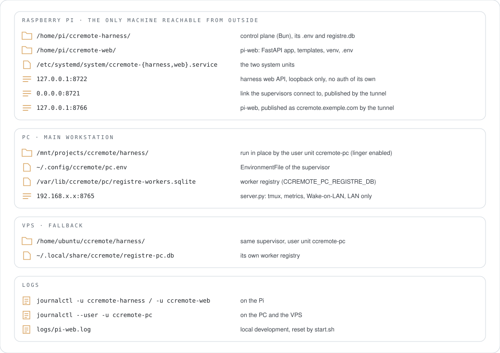
  </picture>
</p>

## Uninstall

<p align="center">
  <picture>
    <source media="(prefers-color-scheme: dark)" srcset="docs/readme/uninstall-dark.svg">
    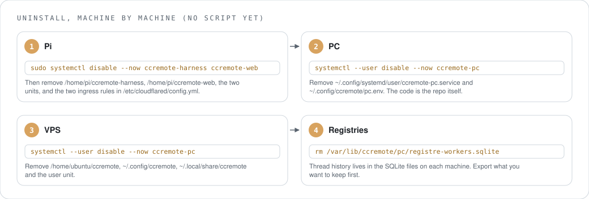
  </picture>
</p>

```sh
# Pi
sudo systemctl disable --now ccremote-harness ccremote-web
sudo rm -r /home/pi/ccremote-harness /home/pi/ccremote-web /etc/systemd/system/ccremote-{harness,web}.service
# PC and VPS
systemctl --user disable --now ccremote-pc
rm ~/.config/systemd/user/ccremote-pc.service ~/.config/ccremote/pc.env
```

Then drop the two ingress rules from `/etc/cloudflared/config.yml` on the Pi and restart `cloudflared`.

## Measured

<p align="center">
  <picture>
    <source media="(prefers-color-scheme: dark)" srcset="docs/readme/bench-dark.svg">
    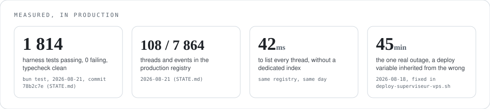
  </picture>
</p>

The test count grows with every mission, so `harness/README.md` does not pin it. The 45 minutes are in the Help table below, because the cause is the kind of thing that happens again.

## What it stands on

<p align="center">
  <picture>
    <source media="(prefers-color-scheme: dark)" srcset="docs/readme/deps-dark.svg">
    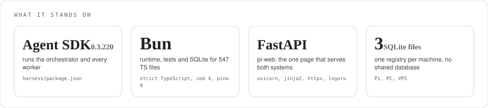
  </picture>
</p>

The harness `node_modules` weighs 597 MB, almost all of it the Claude Code bundled by the SDK. Python only appears where it already was: `server.py` and `pi-web`.

## Help

| Symptom | Cause | Fix |
|---|---|---|
| The Pi cannot see the PC after a restart | the Pi connects to the PC's link when it starts its reconciliation | start the PC supervisor first, then the Pi |
| The VPS supervisor points at a LAN address | it inherited `CCREMOTE_LIEN_URL_PI` from the PC's shell during deploy | set `CCREMOTE_VPS_LIEN_URL_PI` and never the other one; this cost me 45 minutes of downtime once |
| A thread says it has no autonomy left, and your click changes nothing | the auto-approval counter used to start from the window's opening only, so it never reset | fixed: a manual approval now moves the counting mark; update if you run an older build |
| A worker never appears in the registry | its spec held something `JSON.stringify` cannot serialise, and the write failed silently | fixed by projecting specs before persisting; if it comes back, check the supervisor log for the serialisation line |
| A thread is missing from the listings | it had no event yet | fixed with a `LEFT JOIN`; update if you run an older build |
| Search ignores accents | SQLite's `LIKE` is case-insensitive for ASCII only (213 hits for "équipe", 2 for "ÉQUIPE") | search now runs in memory with diacritics stripped |
| "machine absent" on a machine that is clearly on | the supervisor process died while the host stayed up | `systemctl --user restart ccremote-pc` |

Open an issue with the journal of the component involved; each unit has its own.

## Where it stands

Running in production since 22 July 2026: control plane and `pi-web` on the Pi, a supervisor on the PC, a fallback supervisor on the VPS. Open work is tracked in `TODO.md` (about seventy points). The largest: per-conversation scoping of inspection, and a per-worker data channel from the Pi, which does not exist yet.

Leftovers I have not cleaned: an older panel in `pi-web` that chatted with a Cerebras model to drive the machine is still wired, and no longer used since the orchestrator became the way in. The UI is in French.

## Project docs

`ARCHITECTURE.md` (the two systems and their boundary), `STATE.md`, `TODO.md`, `SYNTHESE-CHANTIER.md`, `ARBORESCENCE.md`. The harness has its own `README.md`, `ARCHITECTURE.md` and `ARBORESCENCE.md` under `harness/`.

## Licence

AGPL-3.0-or-later. See `LICENSE`.

---

## Version française

Je parle à un orchestrateur depuis mon téléphone, et il fait tourner des équipes d'agents Claude Code sur mes machines pendant que je suis ailleurs.

Concrètement, deux systèmes partagent une seule page web servie depuis un Raspberry Pi. Un **harness** où un orchestrateur rédige des mandats, lance des équipes supervisées sur un PC (ou un VPS quand le PC est éteint), garde chaque fil dans un registre, et travaille seul dans l'autonomie que tu lui accordes. Et un **panneau de contrôle** de la machine elle-même : sessions tmux, métriques, Wake-on-LAN, comptes Claude et leurs quotas.

> État : en production pour mon usage depuis le 22 juillet 2026, sur trois machines. C'est une infrastructure que je fais tourner tous les jours, pas un produit packagé. Dernière activité : août 2026.

<p align="center">
  
</p>
<p align="center"><sub>La vue du parc : fenêtres d'usage par compte Claude, état des équipes d'un coup d'œil, et les missions qui viennent de finir, avec leur coût.</sub></p>

### Ce qu'il fait

- Fait tourner sur le Pi une session d'orchestrateur qui sert tous tes fils, rédige les mandats, lance les équipes et rend compte.
- Démarre une équipe comme un vrai worker sur le PC : un process, une session Claude Code, un worktree git à elle.
- Demande ton approbation la première fois dans un fil, puis travaille dans la fenêtre d'autonomie que tu as ouverte, jusqu'au plafond que tu poses.
- Tient le parc avec des garde-fous : motifs Bash interdits, juge qui repère les agents qui tournent en rond, budgets par équipe, plafond par compte.
- Apprend entre les missions : les leçons sont extraites des transcriptions, consolidées, puis poussées dans le mandat suivant.
- Tient un registre des workers avec fencing et arrêt d'urgence, un fichier SQLite par machine.
- Pilote le PC lui-même : lister, lancer et tuer des sessions tmux, capturer un pane, envoyer des touches, lire les métriques, le réveiller ou l'éteindre.
- Affiche les comptes Claude avec leurs fenêtres de cinq heures et sept jours, et bascule de l'un à l'autre.
- Vient avec [Vigie](https://github.com/Chrlstopher-c/vigie), un client iOS natif pour le même control plane.

### Comment ça marche

<p align="center">
  <picture>
    <source media="(prefers-color-scheme: dark)" srcset="docs/readme/how-it-works-dark.svg">
    
  </picture>
</p>

Le Pi est la seule machine joignable de l'extérieur, via un tunnel Cloudflare. `pi-web` tient la session et relaie vers l'API du harness, qui refuse de démarrer ailleurs que sur loopback. Les superviseurs du PC et du VPS se connectent *vers* le lien du Pi, donc aucune autre machine n'a besoin d'un port entrant. Démarre le PC en premier : le Pi se réconcilie contre lui au boot.

### Le système d'orchestration

<p align="center">
  <picture>
    <source media="(prefers-color-scheme: dark)" srcset="docs/readme/roles-dark.svg">
    
  </picture>
</p>

Quatre mots, et ils ne sont pas interchangeables. Un **mandat** est un texte : objectif, périmètre, accès, budget, critère d'arrêt. Une **équipe** est ce mandat une fois lancé. Un **worker** est ce que l'équipe est physiquement sur le PC : un process, une session SDK et un worktree git. Un **fil** est ta conversation avec l'orchestrateur, et il n'y en a qu'un pour tous.

<p align="center">
  <picture>
    <source media="(prefers-color-scheme: dark)" srcset="docs/readme/lifecycle-dark.svg">
    
  </picture>
</p>

L'orchestrateur ne peut pas démarrer une équipe lui-même, par construction : `creer_equipe` écrit une proposition et s'arrête là. Le lancement passe par une route d'écriture qu'aucune session d'agent ne peut atteindre.

#### Ce qu'on te demande

<p align="center">
  <picture>
    <source media="(prefers-color-scheme: dark)" srcset="docs/readme/autonomy-dark.svg">
    
  </picture>
</p>

C'est la partie à laquelle je tiens le plus. Valider chaque mandat viderait l'outil de son sens : je ne suis pas là. Un fil gagne donc une fenêtre, et dedans l'orchestrateur lance des équipes, pose ses propres rappels et compacte son contexte sans rien demander. La fenêtre est bornée exprès, parce qu'une fenêtre sans borne n'est plus une fenêtre.

#### Les garde-fous

<p align="center">
  <picture>
    <source media="(prefers-color-scheme: dark)" srcset="docs/readme/guardrails-dark.svg">
    
  </picture>
</p>

Deux méritent le détail. Le plancher de déni tient dans *tous* les modes de permission, y compris celui qui contourne les demandes, parce qu'une équipe qui tourne seule à 3 h du matin est exactement le moment où ça compte. Et le juge anti-boucle est biaisé : dans le doute, ou s'il ne peut pas répondre du tout, le verdict est « incertain », jamais « boucle ». Tuer une équipe qui avance coûte plus cher que laisser une équipe coincée brûler un palier de plus.

#### Quel modèle fait quoi

<p align="center">
  <picture>
    <source media="(prefers-color-scheme: dark)" srcset="docs/readme/models-dark.svg">
    
  </picture>
</p>

L'orchestrateur choisit par mandat : Opus quand l'équipe doit concevoir, Sonnet quand elle doit exécuter un plan connu. L'écart entre les deux est d'environ un facteur dix sur la facture, c'est pour ça que le choix est explicite plutôt que par défaut.

### Installation

<p align="center">
  <picture>
    <source media="(prefers-color-scheme: dark)" srcset="docs/readme/install-dark.svg">
    
  </picture>
</p>

```sh
./deployer-tout.sh --simulation     # répétition à blanc de toute la séquence
./deployer-tout.sh                  # Pi, puis PC, puis VPS, dans cet ordre
```

Tout sur une seule machine, pour développer :

```sh
cd server && python3 -m venv venv && venv/bin/pip install -r requirements.txt && venv/bin/python server.py
./start.sh                          # pi-web sur :8766, demande pi-web/.env
cd harness && bun install && cp .env.example .env && bun run typecheck && bun test
bun run start:pc                    # puis, dans un autre shell :
bun run start:pi
```

Les trois fichiers `.env.example` listent chaque variable. Aucun ne contient de valeur réelle.

### Utilisation

<p align="center">
  <picture>
    <source media="(prefers-color-scheme: dark)" srcset="docs/readme/usage-dark.svg">
    
  </picture>
</p>

Une équipe que tu as approuvée va jusqu'au bout sans toi ; ce que tu as accordé au mandat est ce qu'elle a. Tes messages en cours de route sont des corrections de cap, pas des ordres d'arrêt.

### Sur ton téléphone

<p align="center">
  <a href="https://github.com/Chrlstopher-c/vigie">
    <picture>
      <source media="(prefers-color-scheme: dark)" srcset="docs/readme/vigie-dark.svg">
      
    </picture>
  </a>
</p>

[**Vigie**](https://github.com/Chrlstopher-c/vigie) est le client iOS natif de ce control plane : trancher une décision avec Face ID, suivre un fil, parler à un lead, réveiller une machine, dicter un message. Swift 6 et SwiftUI, compilé sur Arch Linux avec xtool, sans Mac. La page web marche très bien sur téléphone ; Vigie est ce que je garde dans ma poche.

### Où sont les choses

<p align="center">
  <picture>
    <source media="(prefers-color-scheme: dark)" srcset="docs/readme/files-dark.svg">
    
  </picture>
</p>

### Désinstallation

<p align="center">
  <picture>
    <source media="(prefers-color-scheme: dark)" srcset="docs/readme/uninstall-dark.svg">
    
  </picture>
</p>

```sh
# Pi
sudo systemctl disable --now ccremote-harness ccremote-web
sudo rm -r /home/pi/ccremote-harness /home/pi/ccremote-web /etc/systemd/system/ccremote-{harness,web}.service
# PC et VPS
systemctl --user disable --now ccremote-pc
rm ~/.config/systemd/user/ccremote-pc.service ~/.config/ccremote/pc.env
```

Puis retire les deux règles d'ingress de `/etc/cloudflared/config.yml` sur le Pi et redémarre `cloudflared`.

### Mesuré

<p align="center">
  <picture>
    <source media="(prefers-color-scheme: dark)" srcset="docs/readme/bench-dark.svg">
    
  </picture>
</p>

Le nombre de tests grandit à chaque mission, donc `harness/README.md` ne le fige pas. Les 45 minutes sont dans le tableau d'aide plus bas, parce que la cause est du genre à se reproduire.

### Sur quoi il repose

<p align="center">
  <picture>
    <source media="(prefers-color-scheme: dark)" srcset="docs/readme/deps-dark.svg">
    
  </picture>
</p>

Le `node_modules` du harness pèse 597 Mo, presque entièrement le Claude Code embarqué par le SDK. Python n'apparaît que là où il était déjà : `server.py` et `pi-web`.

### Aide

| Symptôme | Cause | Remède |
|---|---|---|
| Le Pi ne voit plus le PC après un redémarrage | le Pi se connecte au lien du PC quand il lance sa réconciliation | démarre le superviseur du PC d'abord, le Pi ensuite |
| Le superviseur du VPS pointe sur une adresse LAN | il a hérité de `CCREMOTE_LIEN_URL_PI` depuis le shell du PC pendant le déploiement | pose `CCREMOTE_VPS_LIEN_URL_PI` et jamais l'autre ; ça m'a coûté 45 minutes de panne une fois |
| Un fil annonce qu'il n'a plus d'autonomie et ton clic n'y change rien | le compteur d'auto-approbations partait de la seule ouverture de fenêtre, donc il ne se remettait jamais à zéro | corrigé : une approbation manuelle déplace maintenant le jalon de comptage ; mets à jour si tu es sur un build plus ancien |
| Un worker n'apparaît jamais dans le registre | sa spec contenait quelque chose que `JSON.stringify` ne sait pas sérialiser, et l'écriture a échoué en silence | corrigé en projetant les specs avant persistance ; si ça revient, cherche la ligne de sérialisation dans le journal du superviseur |
| Un fil manque dans les listes | il n'avait encore aucun événement | corrigé par un `LEFT JOIN` ; mets à jour si tu es sur un build plus ancien |
| La recherche ignore les accents | le `LIKE` de SQLite n'est insensible à la casse que sur l'ASCII (213 résultats pour « équipe », 2 pour « ÉQUIPE ») | la recherche tourne maintenant en mémoire, diacritiques retirés |
| « machine absente » sur une machine visiblement allumée | le processus superviseur est mort alors que l'hôte est resté debout | `systemctl --user restart ccremote-pc` |

Ouvre une issue avec le journal du composant concerné ; chaque unité a le sien.

### Où ça en est

En production depuis le 22 juillet 2026 : control plane et `pi-web` sur le Pi, un superviseur sur le PC, un superviseur de repli sur le VPS. Le travail ouvert est dans `TODO.md` (environ soixante-dix points). Les plus gros : le cloisonnement de l'inspection par conversation, et un canal de données par worker depuis le Pi, qui n'existe pas encore.

Reliquats que je n'ai pas nettoyés : un ancien panneau de `pi-web` qui discutait avec un modèle Cerebras pour piloter la machine est toujours câblé, et n'est plus utilisé depuis que l'orchestrateur est la porte d'entrée.

### Documentation du projet

`ARCHITECTURE.md` (les deux systèmes et leur frontière), `STATE.md`, `TODO.md`, `SYNTHESE-CHANTIER.md`, `ARBORESCENCE.md`. Le harness a ses propres `README.md`, `ARCHITECTURE.md` et `ARBORESCENCE.md` sous `harness/`.

### Licence

AGPL-3.0-or-later. Voir `LICENSE`.
